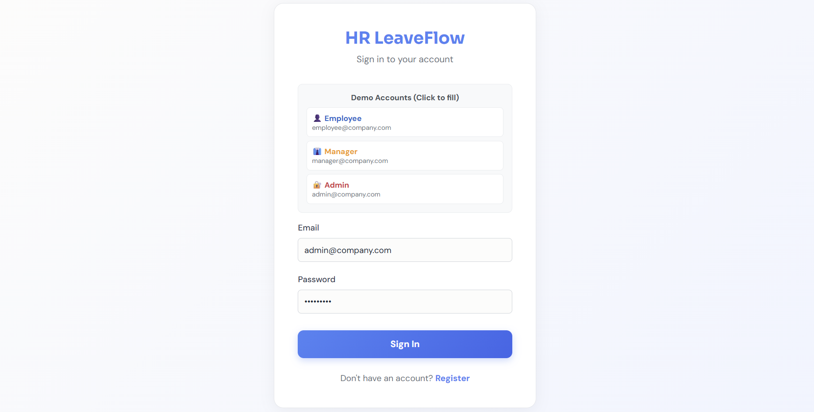
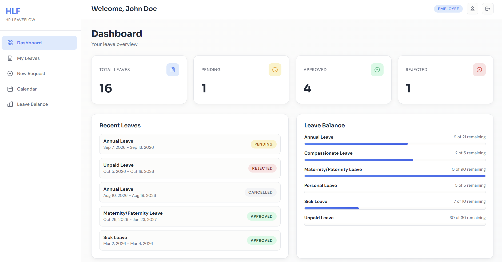
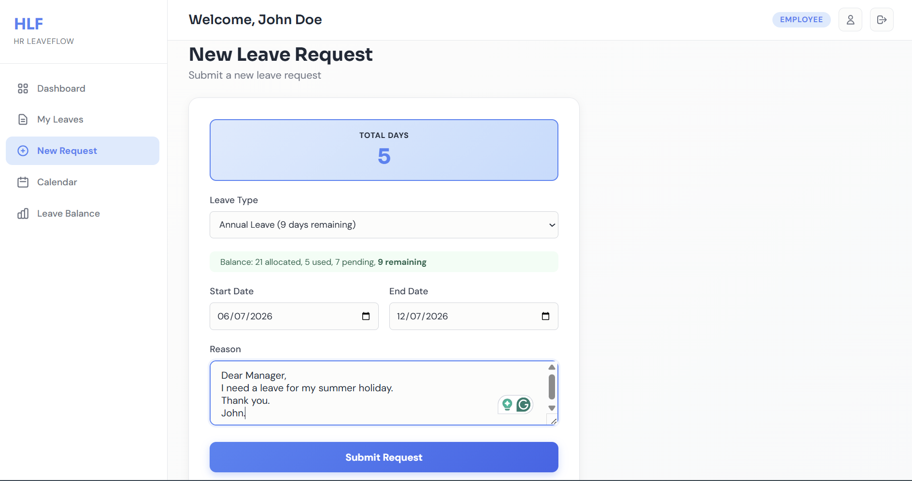
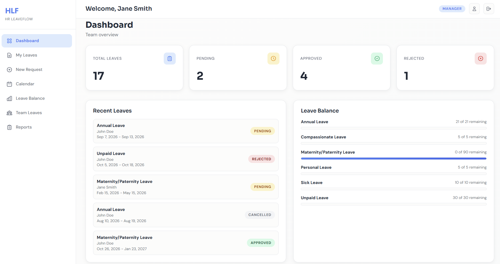
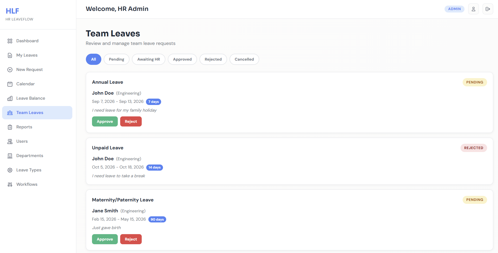
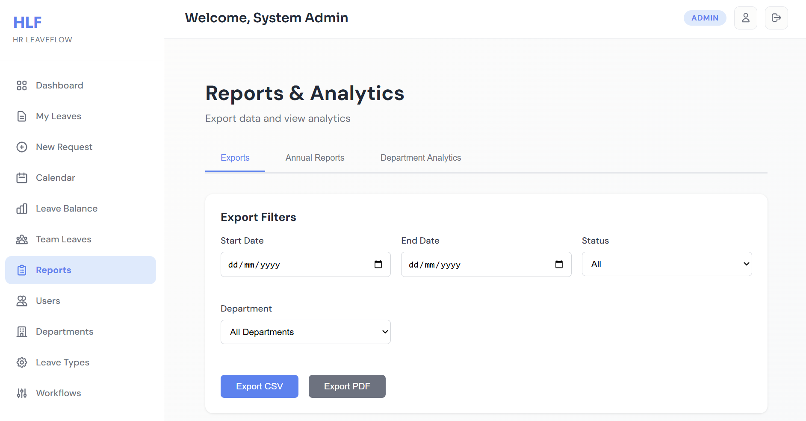
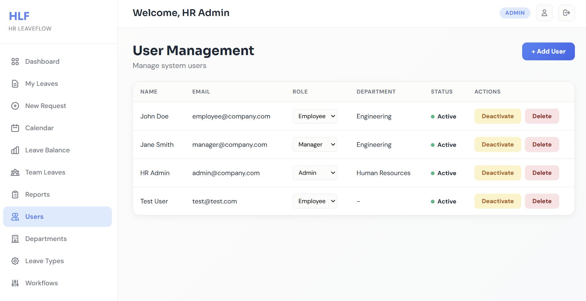
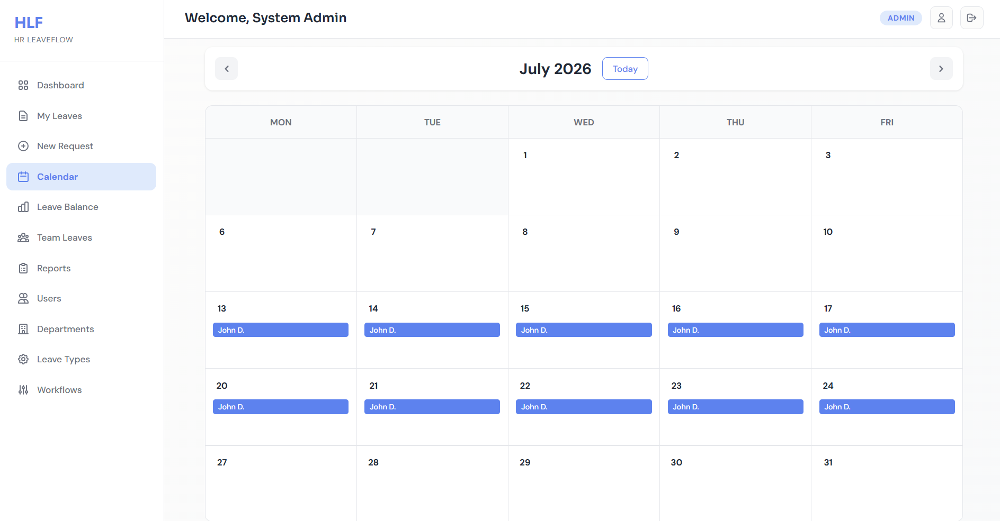
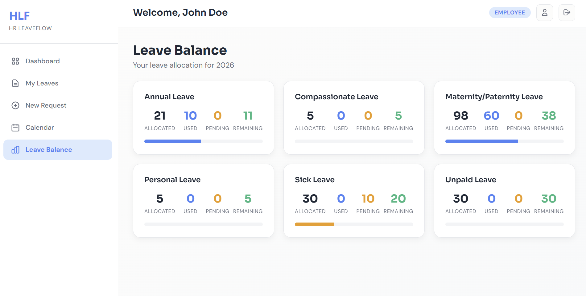
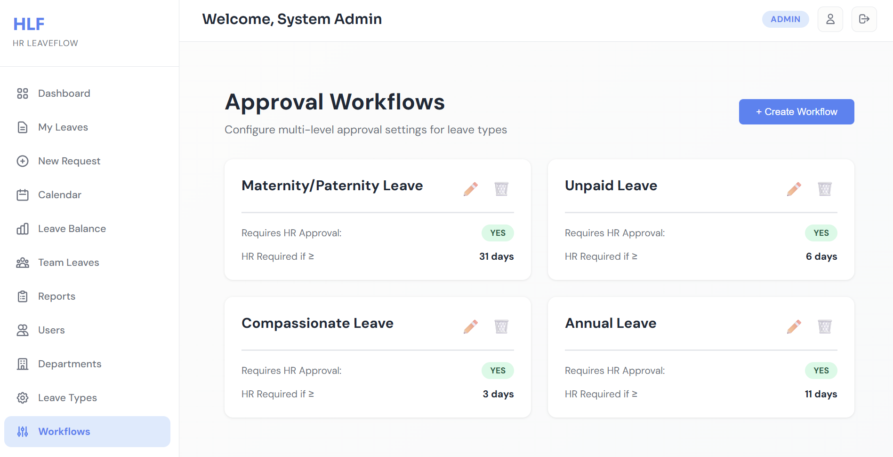

# HR LeaveFlow

**A full-stack leave management system that handles the complete employee leave lifecycle** — from request submission through multi-level managerial and HR approval — with secure JWT authentication, role-based access control, and real-time analytics.

Built to solve a real HR operations problem: replacing spreadsheet-based leave tracking with an automated system that enforces approval chains, prevents scheduling conflicts, and gives managers instant visibility into team availability.

[](https://adeleke-taiwo.github.io/HR-LeaveFlow/)
[](https://hr-leaveflow-ca86.onrender.com/api/v1)
[](https://github.com/adeleke-taiwo/HR-LeaveFlow)


> **[Try it live](https://adeleke-taiwo.github.io/HR-LeaveFlow/)** — demo accounts with click-to-fill are available on the login page. The backend runs on Render's free tier and may take ~30 seconds to wake up on first request.

---

## Screenshots

| | |
|:---:|:---:|
|  |  |
| **Login** — Demo accounts with click-to-fill credentials | **Employee Dashboard** — Leave stats, balance overview, recent requests |
|  |  |
| **Submit Leave** — Auto business day calculation, overlap detection | **Manager Dashboard** — Team overview, quick approve/reject, upcoming leaves |
|  |  |
| **Team Leaves** — Multi-level approval with status filters | **Reports** — Leave trends, department analytics, CSV/PDF export |
|  |  |
| **Admin Panel** — User management, departments, leave types, workflows | **Calendar View** — Team availability at a glance |
|  |  |
| **Leave Balance** — Allocated, used, pending, and remaining days per leave type | **Workflows** — Approval workflow configuration per leave type |

---

## What This Project Demonstrates

| Skill Area | Implementation |
|:-----------|:---------------|
| **API Design** | 35+ RESTful endpoints with layered architecture (Routes → Controllers → Services → DB) |
| **Authentication** | Dual-token JWT — short-lived access tokens + httpOnly refresh cookies with automatic silent refresh |
| **Authorization** | Granular RBAC (Employee / Manager / Admin) enforced at middleware level on every route |
| **Database Design** | 6 relational models with referential integrity, transactional balance updates, and migration history |
| **Business Logic** | Multi-level approval workflows, configurable per leave type with threshold-based HR escalation |
| **Data Integrity** | Atomic Prisma transactions for leave approval — status + balance updated together or not at all |
| **Security** | bcrypt (cost 12), Helmet headers, rate limiting, Zod validation on both client and server, CORS restrictions |
| **Frontend State** | TanStack Query for server state (caching, background refetch), React Context for auth |
| **Reporting** | Interactive Recharts dashboards, CSV/PDF export, annual and department-level analytics |
| **Responsive Design** | Mobile-first with hamburger nav, card-based layouts on small screens, touch-friendly (44px targets) |

---

## Key Features

### Multi-Level Approval Workflow
Configurable approval chains per leave type. A manager approves first; if the request exceeds a configured day threshold (e.g., 5+ days), it automatically escalates to HR for final approval. Both managers and HR can add review comments at each stage.

```
Employee submits → Manager reviews → [HR reviews if required] → Approved/Rejected
```

### Role-Based Access
| Role | What They Can Do |
|:-----|:-----------------|
| **Employee** | Submit leave requests, view/cancel own leaves, check balance, view calendar |
| **Manager** | Everything above + approve/reject department requests, view team calendar, access reports |
| **Admin** | Full system access — manage users, departments, leave types, balances, approval workflows |

### Leave Management
- **6 leave types**: Annual, Sick, Personal, Maternity, Unpaid, Compassionate
- **Smart day calculation**: Excludes weekends for all leave types except Maternity Leave (which counts calendar days including weekends)
- **Overlap detection**: Prevents conflicting leave requests for the same dates
- **Balance enforcement**: Rejects requests when insufficient days remain
- **Transactional updates**: Leave status and balance counters updated atomically

### Analytics & Reporting
- Role-adaptive dashboard with stat cards, trend charts, and upcoming leave widgets
- CSV and PDF export with customizable date range, status, and department filters
- Annual leave reports per employee with breakdown by type
- Department-level utilization analytics with interactive charts

---

## Tech Stack

| Layer | Technology | Purpose |
|:------|:-----------|:--------|
| **Frontend** | React 19 + Vite | Component-based UI with fast HMR |
| **Server State** | TanStack Query v5 | Caching, background refetch, optimistic updates |
| **Forms** | React Hook Form + Zod | Performant forms with schema validation |
| **Charts** | Recharts | Interactive trend, distribution, and utilization visualizations |
| **Backend** | Node.js + Express 5 | REST API with layered architecture |
| **Database** | PostgreSQL + Prisma 5 | Relational integrity, type-safe queries, declarative schema |
| **Auth** | JWT + bcrypt | Dual-token stateless auth with httpOnly refresh cookies |
| **Security** | Helmet + express-rate-limit | HTTP headers hardening and brute-force prevention |
| **Export** | PDFKit + json2csv | Server-side PDF and CSV report generation |

---

## Architecture

```
HR-LeaveFlow/
├── client/                         # React frontend (Vite)
│   ├── src/
│   │   ├── pages/                  # 14 route-level page components
│   │   ├── components/
│   │   │   ├── common/             # ProtectedRoute, StatCard, StatusBadge
│   │   │   ├── layout/             # Sidebar, Header, Layout (responsive)
│   │   │   ├── dashboard/          # QuickActions, UpcomingLeaves, LeaveTrendsChart
│   │   │   └── charts/             # Recharts visualizations
│   │   ├── context/                # AuthContext (global auth state)
│   │   ├── hooks/                  # useAuth custom hook
│   │   ├── services/               # API layer (axios + interceptors)
│   │   └── utils/                  # Constants, date utilities, helpers
│   └── vite.config.js
│
├── server/                         # Express backend
│   ├── src/
│   │   ├── routes/                 # 8 route modules with middleware chains
│   │   ├── controllers/            # 7 controllers — HTTP request/response
│   │   ├── services/               # 7 services — business logic + DB ops
│   │   ├── middleware/             # Auth, RBAC, validation, error handling
│   │   ├── config/                 # Database, environment
│   │   └── utils/                  # ApiError, catchAsync, helpers
│   └── prisma/
│       ├── schema.prisma           # 6 models with relations
│       ├── migrations/             # Version-controlled schema changes
│       └── seed.js                 # Demo data seeding
```

**Backend pattern**: Routes → Controllers → Services → Database, with cross-cutting concerns (auth, validation, error handling) as middleware. Each layer has a single responsibility — controllers handle HTTP concerns, services contain business logic, and Prisma manages data access.

---

## Database Schema

Six interconnected models with enforced referential integrity:

```
User ──────────┬──── Department
 │              │
 │         Leave ──── LeaveType
 │          │
 │     ApprovalWorkflow ──── LeaveType
 │
 └──── LeaveBalance ──── LeaveType
        (unique: userId + leaveTypeId + year)
```

- **User** — Authentication credentials, role (employee/manager/admin), department assignment
- **Department** — Organizational structure
- **LeaveType** — Configurable leave categories with default annual allocations
- **Leave** — Request lifecycle: pending → [pending_hr] → approved/rejected/cancelled
- **LeaveBalance** — Per-user, per-type, per-year tracking (allocated / used / pending)
- **ApprovalWorkflow** — Multi-level approval rules per leave type (HR escalation thresholds)

---

## API Endpoints

Base URL: `/api/v1` — 35+ endpoints across 8 route modules

### Authentication
| Method | Endpoint | Description |
|:-------|:---------|:------------|
| POST | `/auth/register` | Register new user |
| POST | `/auth/login` | Login (returns JWT + sets refresh cookie) |
| POST | `/auth/refresh` | Silent token refresh |
| POST | `/auth/logout` | Logout and clear session |
| GET | `/auth/me` | Current user profile |
| PATCH | `/auth/change-password` | Update password |

### Leaves
| Method | Endpoint | Access | Description |
|:-------|:---------|:-------|:------------|
| POST | `/leaves` | All | Submit leave request |
| GET | `/leaves/my` | All | View own leaves |
| GET | `/leaves/calendar` | All | Calendar data |
| GET | `/leaves/team` | Manager+ | Department leave requests |
| GET | `/leaves` | Admin | All leave records |
| PATCH | `/leaves/:id/status` | Manager+ | Approve or reject |
| PATCH | `/leaves/:id/cancel` | Owner | Cancel own request |
| GET | `/leaves/stats` | Manager+ | Leave statistics |
| GET | `/leaves/upcoming` | Manager+ | Upcoming leaves (next 30 days) |
| GET | `/leaves/export` | Manager+ | Export as CSV or PDF |
| GET | `/leaves/reports/annual/:userId/:year` | Manager+ | Annual employee report |
| GET | `/leaves/reports/department/:deptId` | Admin | Department analytics |

### Admin Resources
| Resource | Endpoints | Access |
|:---------|:----------|:-------|
| Users | GET / POST / PATCH / DELETE `/users` | Admin |
| Departments | GET / POST / PATCH / DELETE `/departments` | Admin (GET: All) |
| Leave Types | GET / POST / PATCH / DELETE `/leave-types` | Admin (GET: All) |
| Leave Balances | GET / POST / PATCH `/leave-balances` | Admin |
| Workflows | GET / POST / PATCH / DELETE `/workflows` | Admin |

---

## Technical Highlights

Engineering decisions and challenges I navigated while building this:

- **Token refresh with zero downtime** — Axios interceptors transparently refresh expired access tokens and retry failed requests, with guard logic to prevent infinite retry loops on auth endpoints themselves

- **Transactional balance management** — Leave approval/rejection updates both the leave status and balance counters atomically using Prisma transactions, preventing race conditions where a balance could go negative

- **Multi-step approval state machine** — Configurable per leave type: standard flow (manager only) or escalated flow (manager → HR) based on day thresholds. The state machine tracks `currentApprovalStep`, reviewer IDs, timestamps, and comments at each level

- **Express 5 error handling** — Adapted middleware for Express 5's breaking change where synchronous errors no longer auto-propagate to error handlers. Built a custom `ApiError` class + `catchAsync` wrapper + centralized handler that differentiates operational errors, Prisma constraint violations, Zod validation failures, and unexpected errors

- **Secure auth architecture** — Access tokens stored in-memory (not localStorage) to prevent XSS exposure. Refresh tokens in httpOnly cookies inaccessible to JavaScript. CORS restricted to the frontend origin only

- **Smart business day calculation** — Leave duration automatically excludes weekends, with overlap detection that queries existing approved/pending leaves for the same date range before allowing submission

---

## Getting Started

### Prerequisites
- **Node.js** v18+
- **PostgreSQL** 14+

### Quick Start

```bash
# Clone
git clone https://github.com/adeleke-taiwo/HR-LeaveFlow.git
cd HR-LeaveFlow

# Backend setup
cd server
npm install
cp .env.example .env          # Edit with your PostgreSQL credentials + JWT secrets
npx prisma migrate dev
npx prisma db seed

# Frontend setup (new terminal)
cd client
npm install

# Run both
cd server && npm run dev       # Backend on port 5000
cd client && npm run dev       # Frontend on port 5173
```

Open `http://localhost:5173` and sign in with a demo account.

### Demo Accounts

| Role | Email | Password | What to Explore |
|:-----|:------|:---------|:----------------|
| **Admin** | admin@company.com | Admin123! | Full system — users, departments, workflows, all leaves |
| **Manager** | manager@company.com | Manager123! | Team leaves, approve/reject, reports, analytics |
| **Employee** | employee@company.com | Employee123! | Submit requests, check balance, view calendar |

---

## About Me

I'm a full-stack developer who builds clean, production-ready applications with modern technologies. This project demonstrates my ability to architect and deliver a complete system end-to-end — from database design and secure API development through to responsive frontend implementation.

**Looking for opportunities** to contribute to impactful products with a collaborative team.

- GitHub: [@adeleke-taiwo](https://github.com/adeleke-taiwo)

---

## License

This project is open source and available under the [MIT License](LICENSE).
